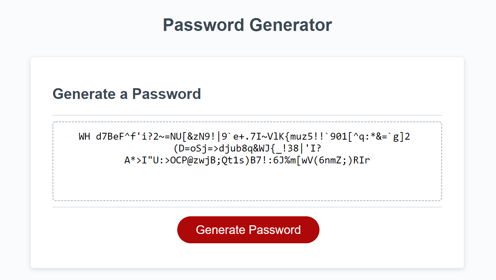

# HW03-JavaScript-Password-Generator

JavaScript: Password Generator

This is a webpage that allows you to generate a password from 8 to 128 characters long. The password can contain any combination of lowercase, uppercase, numerical and special characters. There are 16 character type combinations in total including not using any character types which results in no password given. You are able to generate passwords repeatedly without having to refresh the page.

The password generator was built using JavaScript.

Link to deployed application: [https://r134x7.github.io/HW03-JavaScript-Password-Generator/](https://r134x7.github.io/HW03-JavaScript-Password-Generator/)

This is only a screenshot: 
